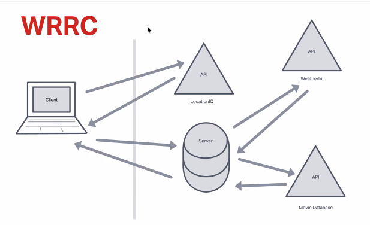

# City Explorer Front-End

**Author**: Rhett Chase

**Version**: 2.0.0
<!-- (increment the patch/fix version number if you make more commits past your first submission) -->

## Overview

The City Explorer application uses a form to capture user input of `city` to return the city's latitude, longitude, a map of the city, the city's forecast, and movies that contain the city's name. The app also shares information on any error if the application is unable to render a result. The user can use this message if something goes wrong so they know they need to make any changes or try again in a different manner.

[Deployed Site](https://city-explorer-rhett.netlify.app)

## Getting Started

The deployed site will run "as is" with no need to install additional dependencies. The front-end is hosted on Nelify with installed environment variable for the LocationIQ API. The back-end is hosted on a custom API server, which provides data for the City Explorer front-end application.

### Install/Confirm Dependencies for Development Use

- Procure a `LocationIQ` API Access Tokens. View, then Update the existing API token
- Create an `.env` file: Your API key goes here for local development. Make sure this file is in your `.gitignore`.
- Add your deployed Netlify app url and your `localhost` as an HTTP Referrer to your API token settings on LocationIQ
- Ensure dependencies are installed by running them with npm commands: Axios and Bootstrap

## Architecture
<!-- Provide a detailed description of the application design. What technologies (languages, libraries, etc) you're using, and any other relevant design information. -->

### Technologies

- React.JS
- Bootstrap
- Javascript
- CSS
- HTML

## Change Log
<!-- Use this area to document the iterative changes made to your application as each feature is successfully implemented. Use time stamps. Here's an example:

01-01-2001 4:59pm - Application now has a fully-functional express server, with a GET route for the location resource. -->

- 12-04-2023 9:36pm - The application now features a fully operational React.js frontend, integrating with the LocationIQ API to retrieve location data. A specific functionality has been implemented to handle requests for the 'location' resource and renders latitude, longitude and map based on a city input
- 12-05-2023 10:00pm - The application now pulls from a locally hosted **weather api** to pull static weather forecast data. A specific functionality has been implemented to handle requests for the 'weather' resource and renders weather forecast based on a city input
- 12-07-2023 Application has been refactored to componentize the front-end codebase. The UI has been updated to use Bootstrap Cards for the weather forecast and movie results.

## Credit and Collaborations

- chatGPT
- React Dev Docs
- WeatherBit API
- LocationIQ API (back-end)
- MovieDB API (back-end)
- Nelify (for hosting deployed site)

## Time Estimate Lab-06

### Locations Latitude/Longitude Feature

Estimate of time needed to complete: 1 hr
Start time: 2 pm
Finish time: 3:30 pm
Actual time needed to complete: 1.5 hrs

### Map Feature

Estimate of time needed to complete: 1 hr
Start time: 4 pm
Finish time: 5 pm
Actual time needed to complete: 1 hr

### Error Feature

Estimate of time needed to complete: 45 min
Start time: 5:10 pm
Finish time: 6:10 pm
Actual time needed to complete: 1 hr

## Time Estimate Lab-07

### Weather Placeholder Front-end

Estimate of time needed to complete: 2 hrs
Start time: 5 pm
Finish time: 8 pm
Actual time needed to complete: 3 hrs

## Time Estimate Lab-09

### Refactor: Componentize & style the front-end codebase

Estimate of time needed to complete: 1.5 hrs
Start time: 2 pm
Finish time: 3 pm
Actual time needed to complete: 1 hr